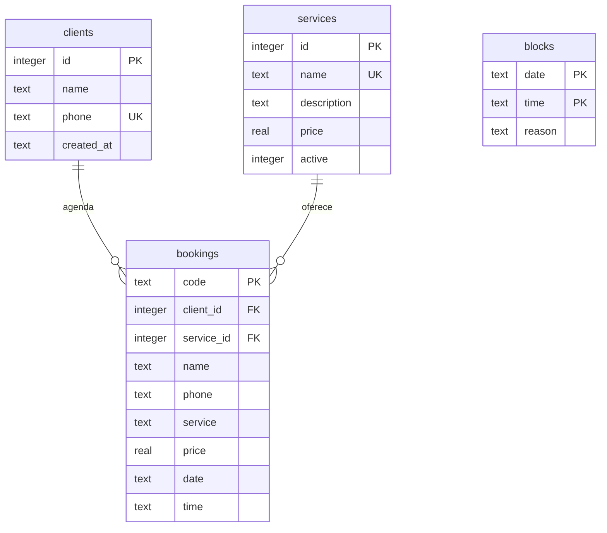

# Banco de dados e proteção das informações

## Tecnologia configurada

O projeto usa SQLite, com chave estrangeira ativada em cada conexão da aplicação, WAL, transações e restrições de integridade. Não foi criado um projeto Supabase. A implantação preparada no Render mantém o banco em um volume persistente, com uma única instância de servidor.

## Tabelas e relacionamentos



- Um cliente possui vários agendamentos. Um serviço também possui vários agendamentos.
- `bookings.client_id` e `bookings.service_id` são obrigatórios. Clientes e serviços referenciados não podem ser removidos diretamente.
- `UNIQUE(date,time)` permite somente um agendamento por horário para o barbeiro. Triggers impedem reserva em horário bloqueado e bloqueio em horário reservado.
- O telefone identifica o cadastro do cliente. Pessoas que usam o mesmo telefone compartilham esse cadastro; os nomes informados em cada reserva permanecem preservados.
- Nome, telefone, serviço e preço em `bookings` são uma cópia histórica da reserva. Alterar o cadastro ou o catálogo não altera as confirmações anteriores.
- O catálogo é sincronizado a partir de `services.mjs` ao iniciar. Serviços retirados do arquivo ficam inativos, preservando relacionamentos históricos. A API consulta o catálogo do banco.
- `migrations` registra importações e mudanças estruturais já aplicadas.

## Migração

Ao abrir um banco antigo, a aplicação gera uma cópia criptografada antes de criar os relacionamentos e executa a alteração numa transação. Códigos, datas, preços, reservas e bloqueios são mantidos. O JSON original continua preservado. Se dados incompatíveis impedirem a migração, a aplicação interrompe a inicialização, em vez de ignorá-los.

## Permissões

| Acesso | Permissão |
| --- | --- |
| Visitante | Catálogo público e disponibilidade sem dados de clientes |
| Portador do código da reserva | Consultar ou cancelar somente aquela reserva |
| Administrador autenticado | Agenda por dia, dados dos clientes, bloqueios e cancelamentos |
| Processo Node.js | Ler e escrever o arquivo SQLite por consultas parametrizadas |
| Operador da hospedagem/computador | Acesso aos arquivos conforme permissões do sistema |

SQLite não possui usuários SQL nem políticas RLS como o Supabase. As permissões dos visitantes e administradores são aplicadas na API, que não oferece acesso direto às tabelas. Arquivos do banco, backups, chave e senha não são servidos por URL nem enviados ao GitHub. O código de confirmação dá acesso à reserva; guarde-o com cuidado.

Em Linux, diretórios privados são criados com modo 700 e chave/backups com modo 600. No Windows, esses modos não substituem as permissões NTFS: restrinja a pasta `data` ao usuário responsável pelo servidor. O arquivo SQLite local não tem criptografia própria; use criptografia de disco e o armazenamento protegido da hospedagem para proteção em repouso.

## Backups

```sh
npm run backup
```

A cópia consistente usa `VACUUM INTO`, incluindo alterações confirmadas no WAL. Depois é criptografada com **AES-256-GCM**, que também detecta adulteração. A cópia temporária sem criptografia é removida. O comando verifica a integridade do banco antes de criar o backup.

Por padrão:

- Arquivos: `data/backups/reservas-<data>-<identificador>.enc`.
- Chave: `data/backup.key`, criada automaticamente se ainda não existir.
- Banco: `data/reservas.sqlite` ou `DATABASE_PATH`.

Configure `BACKUP_INTERVAL_HOURS=24` para criar uma cópia ao iniciar e depois a cada 24 horas, enquanto o servidor estiver ativo. Isso já está declarado no Blueprint do Render. A execução local com `npm start` não carrega `.env` automaticamente; use `node --env-file=.env server.mjs` ou configure as variáveis no ambiente. Não há exclusão automática de backups: acompanhe o espaço do disco e defina a retenção conforme sua operação.

`BACKUP_DIRECTORY` muda o destino das cópias e `BACKUP_KEY_FILE` muda a localização da chave. **Mantenha uma cópia externa dos backups e da chave, separados e em locais privados.** Uma cópia no mesmo disco não protege contra perda desse disco. Sem a chave correta, o backup não pode ser recuperado. Não troque a chave antes de guardar a que protege os backups anteriores.

## Recuperação

```sh
npm run restore -- data/backups/arquivo.enc data/recuperado.sqlite
```

O comando exige a chave original, verifica autenticação criptográfica, integridade SQLite e chaves estrangeiras. Ele recusa sobrescrever qualquer arquivo existente. Após conferir o banco recuperado, pare o servidor e configure `DATABASE_PATH` para esse novo arquivo antes de reiniciar.

As cópias geradas antes da migração estrutural contêm o esquema antigo; a aplicação aplica a migração quando você iniciar com um banco antigo recuperado.

## Limites operacionais

Há um único barbeiro e um único acesso administrativo. As permissões não substituem controle do computador/hospedagem. Clientes permanecem no cadastro após cancelamentos; a retenção e a exclusão de dados pessoais precisam seguir uma política definida pela barbearia. HTTPS deve estar ativo na hospedagem, e o domínio próprio continua pendente de registro.
